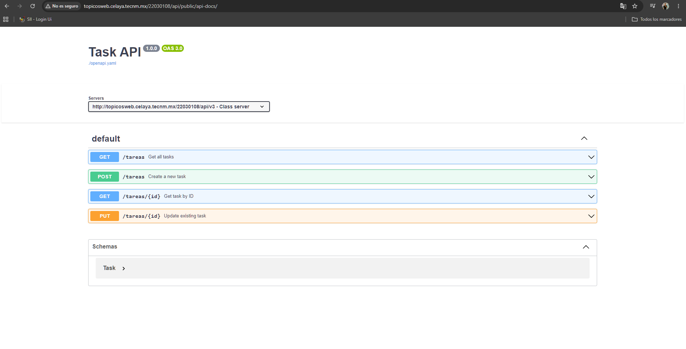
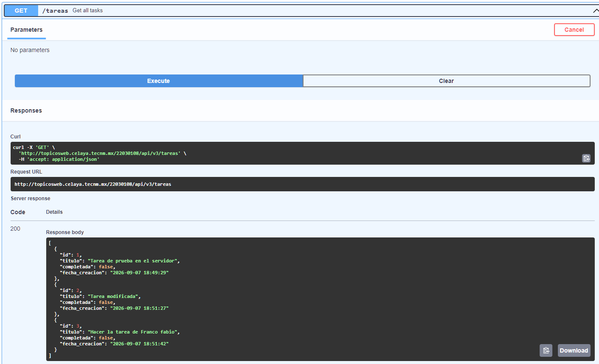
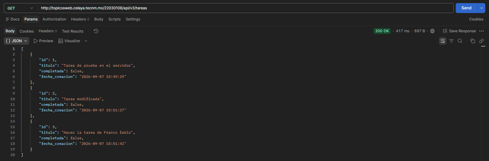
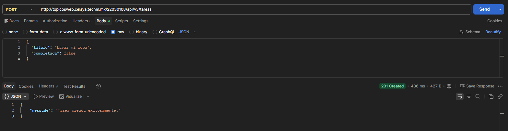
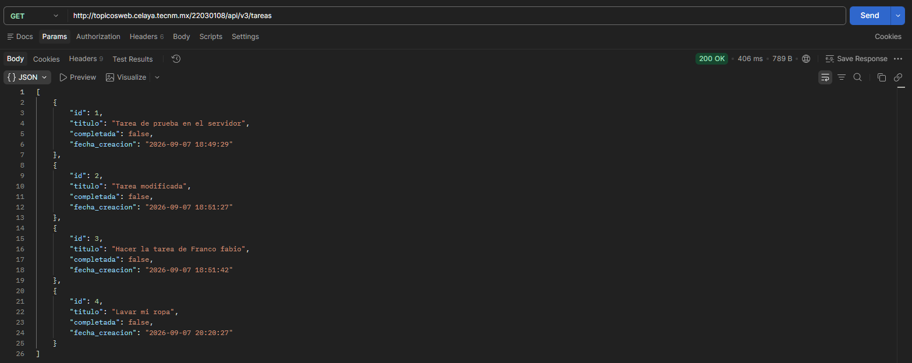

# Introfucción a API-First

En esta prática se implementa una API REST para la gestión de tareas siguiendo el enfoque de diseño API-First. El contrato de la API fue definido utilizando el estándar OpenAPI 3.0 antes de la implementación del código desde SwaggerEditor Online.

## Cómo levantar el proyecto

Para ejecutar este proyecto en un entorno local, sigue estos pasos:

1. Clona este repositorio o copia los archivos en el directorio raíz de tu servidor web local (por ejemplo, `C:\laragon\www\miapp`).
2. Importa el archivo `database.sql` en tu gestor de base de datos MySQL para crear la estructura necesaria, o ejecuta el siguiente script:
   ```sql
   CREATE TABLE tasks (
       id INT AUTO_INCREMENT PRIMARY KEY,
       title VARCHAR(255) NOT NULL,
       is_completed BOOLEAN DEFAULT FALSE,
       created_at DATETIME DEFAULT CURRENT_TIMESTAMP
   );
3. Configura las credenciales de conexión a la base de datos en tu archivo de configuración (e.g., api/config/Database.php)
4. Asegúrate de que el servidor Apache esté en ejecución (mediante Laragon o XAMPP).
5. Accede a la documentación interactiva desde tu navegador en la ruta: http://localhost/miapp/api/public/api-docs/
O se puede usar Postman para probar los endpoints.

## Evidencias
1.- Swagger funcionando



2.- Pruebas en Postman


